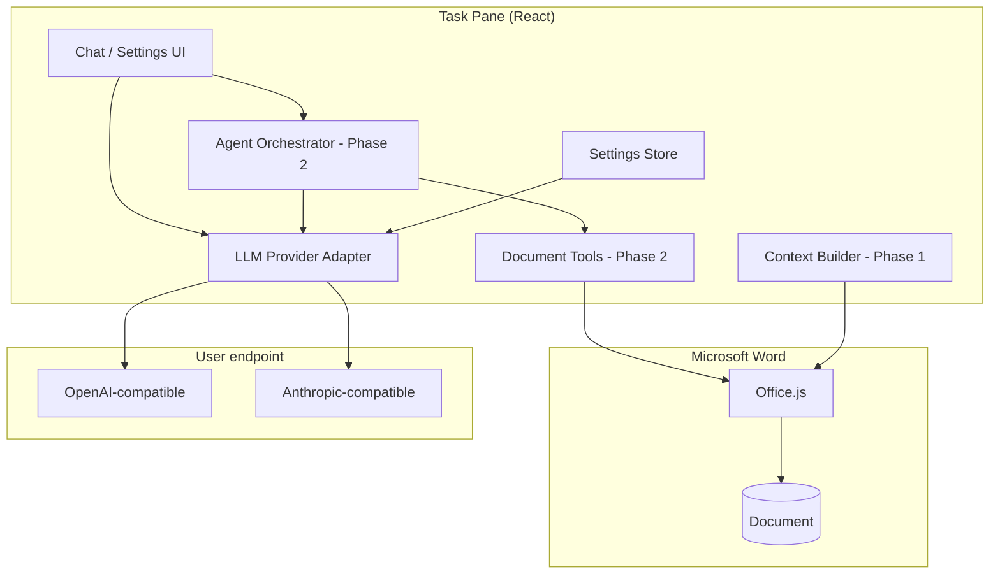

# AGENTS.md — Guide for AI coding agents

This file helps humans and AI agents work effectively in the **msword-aichat** codebase.

## Project mission

Build a **Microsoft Word task-pane add-in** that provides:

1. **Contextual AI chat** about the open document
2. **Agentic editing** via tool calls against Office.js (planned)
3. **Bring-your-own-model** via OpenAI- or Anthropic-compatible HTTP APIs

The agent loop and document edit tools are **not implemented yet**. Phase 1 delivers document context in chat prompts; Phase 2 adds the tool loop.

**Minimum supported host:** Word 2016+ or Microsoft 365 Word (not Office 2013).

---

## Current state (Phase 1 — complete)

| Area | Implemented | Location |
|------|-------------|----------|
| Office add-in manifest | Yes | `manifest.xml` |
| Vite + React + TypeScript shell | Yes | `taskpane.html`, `src/taskpane/` |
| Provider settings UI | Yes | `src/taskpane/components/SettingsPanel.tsx` |
| Settings persistence | Yes | `src/settings/store.ts` |
| OpenAI-compatible adapter | Yes | `src/llm/openai-compatible.ts` |
| Anthropic-compatible adapter | Yes | `src/llm/anthropic-compatible.ts` |
| Streaming chat | Yes | `src/hooks/useChat.ts` |
| Word context (selection, outline) | Yes | `src/word/context.ts` |
| Context mode UI + quick actions | Yes | `ContextBar.tsx`, `QuickActions.tsx` |
| Agent orchestrator | No | `src/agent/` (Phase 2) |
| Document edit tools | No | `src/agent/tools/` (Phase 2) |

---

## Repository layout

```
src/
├── llm/
│   ├── provider.ts           # LLMProvider interface, normalizeBaseUrl
│   ├── openai-compatible.ts  # POST {baseUrl}/chat/completions
│   ├── anthropic-compatible.ts # POST {baseUrl}/messages
│   └── factory.ts            # createProvider(config)
├── settings/
│   ├── defaults.ts           # DEFAULT_PROVIDER_CONFIG, storage keys
│   └── store.ts              # Zustand: load/save/getConfig
├── hooks/
│   ├── useChat.ts            # Streaming chat with document context injection
│   └── useDocumentContext.ts # Context preview + refresh
├── word/
│   └── context.ts            # getSelectionText, getDocumentOutline, estimateTokens
├── types/
│   ├── llm.ts                # ProviderConfig, ChatMessage, ChatEvent, PingResult
│   └── context.ts            # ContextMode, DocumentContext
└── taskpane/
    ├── main.tsx              # Office.onReady → render App
    ├── App.tsx               # View routing: chat | settings
    ├── index.css             # Layout styles (prefer Fluent tokens in components)
    └── components/
        ├── Header.tsx
        ├── ChatPanel.tsx
        ├── MessageList.tsx
        ├── MessageInput.tsx
        └── SettingsPanel.tsx
```

**Planned directories (do not invent unrelated structure):**

```
src/agent/
├── orchestrator.ts       # Tool-call loop (Phase 2)
├── system-prompt.ts
└── tools/
    ├── registry.ts
    ├── get-selection.ts
    ├── get-document-text.ts
    └── replace-text.ts

src/word/
├── context.ts            # Selection, outline, chunking (Phase 1)
└── operations.ts         # Low-level Office.js helpers
```

---

## Architecture



**Data flow today (Phase 0):** `MessageInput` → `useChat` → `createProvider` → SSE stream → `MessageList`.

**Target flow (Phase 2+):** User message → context builder → agent orchestrator → LLM with tools → execute Office.js ops → stream result + show diff preview.

---

## Hard constraints

### Office add-in runtime

- Dev server **must** use **HTTPS** on **port 3000** (see `vite.config.ts`, `manifest.xml`)
- Entry point: `taskpane.html` → `src/taskpane/main.tsx`
- Initialize with `Office.onReady()` before rendering (already in `main.tsx`)
- Manifest host: `Document` (Word only). Do not broaden hosts without explicit request
- Permissions: `ReadWriteDocument` — required for future edit tools

### Office.js

- All Word API calls must run inside `Word.run(async (context) => { ... })`
- Load objects before reading: `context.sync()`
- Prefer range/paragraph-level operations; avoid assuming full OOXML access
- Test Desktop and Web when touching document APIs (parity differs)

### LLM providers

- **No heavyweight SDKs** — use `fetch` + SSE parsers in `src/llm/`
- Extend via `LLMProvider` interface in `src/llm/provider.ts`
- `createProvider()` in `factory.ts` is the single construction path
- Tool-calling event types will be added to `ChatEvent` in Phase 2 — keep adapters backward-compatible

### Settings & secrets

- Non-secret config: `localStorage` key `msword-aichat:provider-config`
- API key: separate key `msword-aichat:api-key`
- Never commit API keys, `.env` secrets, or real endpoints
- `useSettingsStore.getConfig()` is the canonical way to read runtime config

### UI

- Use **Fluent UI React v9** (`@fluentui/react-components`) for controls
- Match existing patterns in `SettingsPanel.tsx` and `Header.tsx`
- Keep task-pane layout vertical: toolbar → scrollable body → input bar

---

## Phased roadmap (implementation order)

### Phase 1 — Document context (complete)

Delivered: `src/word/context.ts`, context mode bar, token estimate, quick actions, context injected into `useChat` system prompt.

### Phase 2 — Agent MVP (next)

**Goal:** Multi-step tool loop with safe apply flow.

Tasks:

1. Create `src/agent/orchestrator.ts` — loop with `MAX_AGENT_STEPS` (e.g. 10)
2. Extend `ChatEvent` for `tool_call_start`, `tool_call_delta`, `tool_result`
3. Extend both LLM adapters to send/receive tool schemas
4. Implement tools in `src/agent/tools/`:
   - `get_selection`, `get_document_text` (chunked), `insert_text`, `replace_text`
5. UI: agent step trace, diff preview, Apply / Reject
6. Default: **ask before apply**

**Exit criteria:** "Rewrite this paragraph formally" executes `replace_text` after user confirms preview.

### Phase 3 — Editing depth

Styles, formatting, tables, search, undo snapshots, co-authoring error handling.

### Phase 4 — Ship

Onboarding, Word on the web QA, optional `/models` fetch, distribution package.

---

## How to add a new LLM provider

1. Add a variant to `ProviderKind` in `src/types/llm.ts`
2. Implement `LLMProvider` in `src/llm/<name>.ts`
3. Register in `src/llm/factory.ts`
4. Add option in `SettingsPanel.tsx` dropdown
5. Add default base URL in `useSettingsStore.setKind()`
6. Manual test: Save → Test connection → Send chat message

---

## How to add an agent tool (Phase 2+)

1. Define JSON Schema for parameters in `src/agent/tools/<tool-name>.ts`
2. Implement `execute(args, context)` returning structured JSON (`success`, `preview`, `error`)
3. Register in `src/agent/tools/registry.ts`
4. All Word mutations go through `src/word/operations.ts` helpers — do not duplicate Office.js boilerplate
5. Validate args (recommend Zod when tool layer is introduced)
6. Update system prompt in `src/agent/system-prompt.ts` to describe the tool

**Tool design rules:**

- Return small previews, not full document bodies
- Never throw uncaught errors — return `{ success: false, error: "..." }`
- Idempotent where possible; prefer `replace_text` with explicit range IDs
- Log each step for the agent trace panel

---

## Code conventions

| Topic | Convention |
|-------|------------|
| Language | TypeScript strict mode |
| Imports | Relative paths within `src/` |
| State | Zustand for global settings; React `useState` for ephemeral chat UI |
| Styling | Fluent `makeStyles` for components; `index.css` for layout shell only |
| Async | `async/await`; streaming via `AsyncIterable<ChatEvent>` |
| Errors | Surface user-readable messages in UI; no silent failures |
| File naming | kebab-case files, PascalCase React components |

**Keep changes focused.** Match existing style. Do not refactor unrelated files. Do not add doc files unless asked.

**Commits:** Complete sentences; prefix with `feat:`, `fix:`, `docs:`, `refactor:` as appropriate. Commit when a logical unit is done (scaffold, layer, feature).

---

## Development commands

```bash
npm install
npm run dev          # https://localhost:3000
npm start            # sideload in Word (Desktop)
npm run build        # production build
npm run typecheck
npm run validate     # manifest.xml
```

### Verification checklist (run before marking a phase done)

- [ ] `npm run typecheck` passes
- [ ] `npm run build` passes
- [ ] `npm run validate` passes
- [ ] Settings save/load round-trip works
- [ ] Connection test succeeds against a real or mock endpoint
- [ ] Chat streams without duplicating messages
- [ ] (Phase 1+) Selection context appears in outgoing prompt
- [ ] (Phase 2+) Tool loop respects step cap and cancel

---

## Testing notes

- **No automated E2E in repo yet.** Office.js requires Word host.
- For provider logic, consider a local mock SSE server in tests (future)
- Browser test: `https://localhost:3000/taskpane.html` (no Office.js document APIs)
- CORS: if the task pane calls a remote gateway, the gateway must allow the add-in origin or users need a local proxy — document this in PR descriptions when relevant

---

## Common pitfalls

| Pitfall | Guidance |
|---------|----------|
| Calling LLM SDKs | Use existing adapters in `src/llm/` |
| Duplicate `useChat` instances | Single owner in `App.tsx`; pass props to `ChatPanel` |
| HTTP dev server | Office requires HTTPS — keep `basicSsl` plugin |
| Wrong icon paths | Icons live in `public/assets/` → served as `/assets/icon-*.png` |
| Manifest version | Must be `>= 1.0.0.0` (see `manifest.xml`) |
| Huge prompts | Phase 1 must chunk/bound context; never dump full doc by default |
| Agent loops | Cap steps; show trace; allow cancel (Phase 2) |

---

## Key files to read first

When starting a task, read these before editing:

1. `src/types/llm.ts` — core types
2. `src/llm/provider.ts` — provider contract
3. `src/settings/store.ts` — config access pattern
4. `src/hooks/useChat.ts` — chat flow (will integrate agent in Phase 2)
5. `src/taskpane/App.tsx` — top-level composition
6. `manifest.xml` — Office host capabilities and URLs

---

## Out of scope (unless explicitly requested)

- Outlook / Excel / PowerPoint hosts
- Server-side proxy service (optional future; not Phase 1)
- Copilot / Microsoft 365 native integration
- Offline/on-device models without HTTP endpoint
- VBA or COM add-in bridge
- Public AppSource submission assets

---

## Questions to ask the user when ambiguous

- Desktop only vs Word on the web for this phase?
- Auto-apply edits vs always preview?
- Which provider type to prioritize for new features?
- Enterprise proxy requirement (CORS / key hiding)?

When defaults are acceptable, prefer: **Desktop first**, **preview before apply**, **OpenAI-compatible first**, **no proxy in v1**.