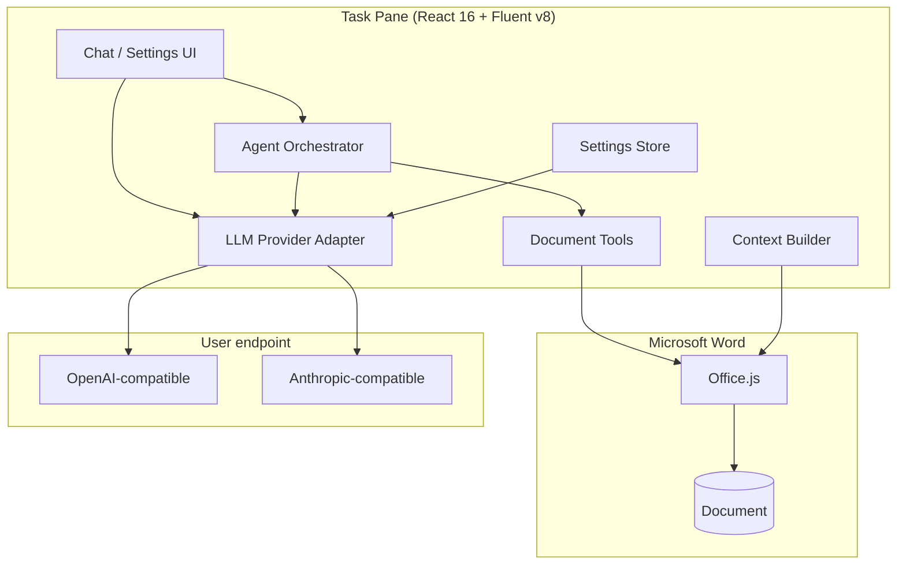

# AGENTS.md — Guide for AI coding agents

This file helps humans and AI agents work effectively in the **msword-aichat** codebase.

## Project mission

Build a **Microsoft Word task-pane add-in** that provides:

1. **Contextual AI chat** about the open document
2. **Agentic editing** via tool calls against Office.js
3. **Bring-your-own-model** via OpenAI- or Anthropic-compatible HTTP APIs

Phase 5 delivers conversation persistence, custom instructions, slash commands, `insert_comment`, and a dev CORS proxy. Remaining backlog items are optional future work.

**Minimum supported host:** Word **2016 Windows** (IE11 task pane). Also runs on Office 2019+ / M365 (WebView2) and Word on the web. Built with Webpack + React 16 + Fluent UI v8 + ES5.

---

## Current state (ship-ready)

| Area | Implemented | Location |
|------|-------------|----------|
| Office add-in manifest | Yes | `manifest.xml` (dev), `manifest.prod.xml` (deploy) |
| Webpack + React 16 + Fluent v8 shell | Yes | `webpack.config.cjs`, `src/taskpane/main.legacy.tsx`, `components.legacy/` |
| Provider settings UI | Yes | `src/taskpane/components.legacy/SettingsPanel.tsx` |
| Settings persistence | Yes | `src/settings/store.legacy.ts` |
| Model list fetch (`/models`) | Yes | `src/llm/models.ts` |
| OpenAI-compatible adapter + tools | Yes | `src/llm/openai-compatible.ts`, XHR SSE via `sse-reader.ts` |
| Anthropic-compatible adapter + tools | Yes | `src/llm/anthropic-compatible.ts`, agent transcript replay |
| Chat mode (streaming) | Yes | `src/hooks/useChat.legacy.ts` |
| Agent mode (tool loop) | Yes | `src/agent/orchestrator.ts` |
| Agent tools (14 total) | Yes | `src/agent/tools/registry.ts` |
| Per-document conversation store | Yes | `src/conversation/store.legacy.ts`, `useDocumentKey.legacy.ts` |
| Custom instructions / review mode | Yes | `src/settings/defaults.ts`, `prompt-options.ts` |
| Slash commands + hints | Yes | `src/agent/slash-commands.ts`, `MessageInput.legacy.tsx` |
| `insert_comment` tool | Yes | `src/word/operations.ts`, registry |
| `list_tables` / `update_table` | Yes | `src/word/operations.ts`, registry (in-place table edits) |
| Dev CORS proxy | Yes | `proxy/dev-proxy.mjs` |
| Word operations | Yes | `src/word/operations.ts` |
| Range bookmarks (stable apply) | Yes | `src/word/ranges.ts` |
| Undo snapshots | Yes | `src/word/undo.ts` |
| Edit preview + Undo UI | Yes | `components.legacy/EditPreview.tsx` |
| Error retry + copy | Yes | `ErrorActions.tsx`, `useChat.legacy` retry |
| Agent step trace | Yes | `AgentTrace.tsx` |
| Word context (selection, outline) | Yes | `src/word/context.ts` |
| Distribution package script | Yes | `scripts/package-addin.mjs` |
| Local distribution (localhost) | Yes | `scripts/package-local.mjs`, `install-certificate.mjs`, `sideload-add-in.mjs`, `local-server.mjs` |
| Automated smoke test | Yes | `scripts/smoke-test.mjs` |

**Legacy build skips:** onboarding wizard, telemetry, Vite/React 19/Fluent v9 UI path.

---

## Repository layout

```
src/
├── agent/
│   ├── orchestrator.ts       # Tool-call loop (MAX_AGENT_STEPS=10)
│   ├── system-prompt.ts
│   └── tools/
│       └── registry.ts       # Tool defs, executeTool, applyPendingEdit
├── llm/
│   ├── provider.ts           # LLMProvider: chat(), complete(), ping()
│   ├── openai-compatible.ts
│   ├── anthropic-compatible.ts
│   └── factory.ts
├── settings/
│   ├── defaults.ts           # Provider config + AppPreferences
│   └── store.legacy.ts       # Pub/sub settings (IE-safe)
├── hooks/
│   ├── useChat.legacy.ts     # Chat + agent modes, apply/reject edits
│   └── useDocumentContext.legacy.ts
├── word/
│   ├── context.ts            # Selection, outline, chunking
│   ├── operations.ts         # search, styles, format, table
│   ├── ranges.ts             # Bookmark capture for stable apply
│   └── undo.ts               # Revert applied edits
├── types/
│   ├── llm.ts
│   ├── context.ts
│   └── agent.ts
└── taskpane/
    ├── App.legacy.tsx
    ├── main.legacy.tsx
    └── components.legacy/    # Fluent v8 UI (IeSelect for IE11 dropdowns)
        ├── ChatToolbar.tsx   # Mode + context + refresh + session status
        ├── ChatPanel.tsx
        ├── AgentTrace.tsx
        ├── EditPreview.tsx
        └── ...
```

---

## Architecture



**Chat mode:** `MessageInput.legacy` → `useChat.legacy` → `createProvider().chat()` → SSE stream (XHR on IE11) → `MessageList`.

**Agent mode:** `MessageInput.legacy` → `useChat.legacy` → `runAgent()` → `provider.complete()` with tools → `executeTool()` → optional `PendingEdit` → `EditPreview` → `applyPendingEdit()`.

---

## Hard constraints

### Office add-in runtime

- Dev server **must** use **HTTPS** on **port 3000** (see `webpack.config.cjs`, `manifest.xml`)
- Entry point: `taskpane.html` (webpack output) → `src/taskpane/main.legacy.tsx`
- Initialize with `Office.onReady()` before rendering (already in `main.legacy.tsx`)
- Webpack dev server: `hot: false`, `client.overlay: false` (IE11 dev overlay noise)
- Manifest host: `Document` (Word only). Do not broaden hosts without explicit request
- Permissions: `ReadWriteDocument` — required for future edit tools

### Office.js

- All Word API calls must run inside `Word.run(async (context) => { ... })`
- Load objects before reading: `context.sync()`
- Prefer range/paragraph-level operations; avoid assuming full OOXML access
- Test Desktop and Web when touching document APIs (parity differs)

### LLM providers

- **No heavyweight SDKs** — use `fetch` + SSE parsers in `src/llm/`
- Extend via `LLMProvider` interface in `src/llm/provider.ts`
- `createProvider()` in `factory.ts` is the single construction path
- Tool-calling event types will be added to `ChatEvent` in Phase 2 — keep adapters backward-compatible

### Settings & secrets

- Non-secret config: `localStorage` key `msword-aichat:provider-config`
- API key: separate key `msword-aichat:api-key`
- Never commit API keys, `.env` secrets, or real endpoints
- `settingsStore.getConfig()` from `src/settings/store.legacy.ts` is the canonical way to read runtime config

### UI

- Use **Fluent UI React v8** (`@fluentui/react`) for controls
- Use native `<select>` via `IeSelect.tsx` on IE11 — avoid Fluent `Dropdown` / `CommandBar` overflow in the task pane
- Match existing patterns in `components.legacy/SettingsPanel.tsx` and `Header.tsx`
- Keep task-pane layout vertical: toolbar → scrollable body → input bar

---

## Phased roadmap (implementation order)

### Phase 1 — Document context (complete)

Delivered: `src/word/context.ts`, context modes, token estimate (UI consolidated in `ChatToolbar.tsx`).

### Phase 2 — Agent MVP (complete)

Delivered: `runAgent`, four document tools, `complete()` on both providers, `EditPreview`, `AgentTrace`, Chat/Agent mode toggle, `autoApplyEdits` preference.

### Phase 3 — Editing depth (complete)

Delivered: `search_document`, `delete_range`, `apply_style`, `format_range`, `insert_table`, bookmark-stable apply, undo button, co-authoring-friendly errors.

**Known limitations:**
- Bookmark deletion is not exposed by Word JS API; `msword_aichat_*` bookmarks may remain.
- `insert_table` undo deletes the last document table (best-effort).
- `update_table` requires matching rows/columns; resizes are not supported yet.
- `replace_text` is blocked when the selection is inside a table — use `update_table`.
- `find_and_replace` / `replace_at_match` skip table cells by default; use `update_table` for table edits.
- `search_document` must not load `range.start`/`end` on Word 2016; positions are estimated from `body.text`.
- Table cell writes use `table.values` after `context.sync()` (Word 2016–safe).

### Phase 4 — Polish & ship (complete)

Delivered: onboarding wizard, `/models` fetch, error retry/copy, `manifest.prod.xml`, `npm run package`, Vite code-splitting, opt-in telemetry stub, Word on the web QA checklist in README.

### Phase 5 — Advanced (complete)

Delivered: per-document conversation persistence, custom instructions, review mode, slash commands (`/fix`, `/table`, `/toc`, `/summarize`, `/formal`, `/comment`), `insert_comment` tool, dev CORS proxy (`npm run proxy`), optional remote telemetry endpoint.

**Backlog (not scheduled):** RAG attachments, voice input, multi-document awareness, full enterprise proxy service.

---

## How to add a new LLM provider

1. Add a variant to `ProviderKind` in `src/types/llm.ts`
2. Implement `LLMProvider` in `src/llm/<name>.ts`
3. Register in `src/llm/factory.ts`
4. Add option in `SettingsPanel.tsx` dropdown
5. Add default base URL in `useSettingsStore.setKind()`
6. Manual test: Save → Test connection → Send chat message

---

## How to add an agent tool (Phase 2+)

1. Define JSON Schema for parameters in `src/agent/tools/<tool-name>.ts`
2. Implement `execute(args, context)` returning structured JSON (`success`, `preview`, `error`)
3. Register in `src/agent/tools/registry.ts`
4. All Word mutations go through `src/word/operations.ts` helpers — do not duplicate Office.js boilerplate
5. Validate args (recommend Zod when tool layer is introduced)
6. Update system prompt in `src/agent/system-prompt.ts` to describe the tool

**Tool design rules:**

- Return small previews, not full document bodies
- Never throw uncaught errors — return `{ success: false, error: "..." }`
- Idempotent where possible; prefer `replace_text` with explicit range IDs for plain text only
- **Tables:** `insert_table` creates; `list_tables` + `update_table` edits in place; never `replace_text` on table selections
- Log each step for the agent trace panel

**Registered agent tools (14):** `get_selection`, `get_document_text`, `search_document`, `list_tables`, `insert_text`, `replace_text`, `find_and_replace`, `replace_at_match`, `delete_range`, `apply_style`, `format_range`, `insert_table`, `update_table`, `insert_comment`.

---

## Code conventions

| Topic | Convention |
|-------|------------|
| Language | TypeScript strict mode |
| Imports | Relative paths within `src/` |
| State | `settingsStore` pub/sub (`store.legacy.ts`); React `useState` for ephemeral chat UI |
| Styling | Fluent v8 `mergeStyles` / layout classes; `index.css` for shell only |
| Async | `async/await`; streaming via `AsyncIterable<ChatEvent>` |
| Errors | Surface user-readable messages in UI; no silent failures |
| File naming | kebab-case files, PascalCase React components |

**Keep changes focused.** Match existing style. Do not refactor unrelated files. Do not add doc files unless asked.

**Commits:** Complete sentences; prefix with `feat:`, `fix:`, `docs:`, `refactor:` as appropriate. Commit when a logical unit is done (scaffold, layer, feature).

---

## Development commands

```bash
npm install
npm run dev          # https://localhost:3000
npm start            # sideload in Word (Desktop)
npm run build        # production build
npm run typecheck
npm run validate     # manifest.xml
npm run package      # build + assemble package/ for deployment
npm run package:local      # local distribution → release/msword-aichat-local/
npm run package:local:exe  # same + self-contained Windows .exe launchers (pkg node22-win-x64)
npm run serve:local  # HTTPS static server for dist/ (port 3000)
npm run proxy        # local CORS proxy for dev gateways
npm run smoke        # automated smoke test pass
```

### Verification checklist (run before marking a phase done)

- [ ] `npm run typecheck` passes
- [ ] `npm run build` passes
- [ ] `npm run validate` passes
- [ ] Settings save/load round-trip works
- [ ] Connection test succeeds against a real or mock endpoint
- [ ] Chat streams without duplicating messages
- [ ] (Phase 1+) Selection context appears in outgoing prompt
- [ ] (Phase 2+) Tool loop respects step cap and cancel

---

## Testing notes

- **No automated E2E in repo yet.** Office.js requires Word host.
- For provider logic, consider a local mock SSE server in tests (future)
- Browser test: `https://localhost:3000/taskpane.html` (no Office.js document APIs)
- CORS: if the task pane calls a remote gateway, the gateway must allow the add-in origin or users need a local proxy — document this in PR descriptions when relevant

---

## Common pitfalls

| Pitfall | Guidance |
|---------|----------|
| Calling LLM SDKs | Use existing adapters in `src/llm/` |
| Duplicate `useChat` instances | Single owner in `App.legacy.tsx`; pass props to `ChatPanel` |
| HTTP dev server | Office requires HTTPS — use `office-addin-dev-certs` via webpack-dev-server |
| Table edits via `replace_text` | Word `GeneralException` — use `update_table`; guard in `executeReplaceText` |
| IE11 dropdown white screen | Use `IeSelect`, not Fluent `Dropdown` / CommandBar overflow |
| Wrong icon paths | Icons live in `public/assets/` → served as `/assets/icon-*.png` |
| Manifest version | Must be `>= 1.0.0.0` (see `manifest.xml`) |
| Huge prompts | Phase 1 must chunk/bound context; never dump full doc by default |
| Agent loops | Cap steps; show trace; allow cancel (Phase 2) |
| Local distribution exes | Use `node22-win-x64` pkg target; `node20`/`node18` may 404 in pkg-fetch cache |
| Sideload exe size | `office-addin-dev-settings` pulls a large dependency tree (~60 MB per launcher exe) |

---

## Key files to read first

When starting a task, read these before editing:

1. `src/types/llm.ts` — core types
2. `src/llm/provider.ts` — provider contract
3. `src/settings/store.legacy.ts` — config access pattern
4. `src/hooks/useChat.legacy.ts` — chat + agent flow
5. `src/taskpane/App.legacy.tsx` — top-level composition
6. `src/word/operations.ts` — table/search helpers (`table.values`, `list_tables`, `update_table`)
6. `manifest.xml` — Office host capabilities and URLs

---

## Out of scope (unless explicitly requested)

- Outlook / Excel / PowerPoint hosts
- Server-side proxy service (optional future; not Phase 1)
- Copilot / Microsoft 365 native integration
- Offline/on-device models without HTTP endpoint
- VBA or COM add-in bridge
- Public AppSource submission assets

---

## Questions to ask the user when ambiguous

- Desktop only vs Word on the web for this phase?
- Auto-apply edits vs always preview?
- Which provider type to prioritize for new features?
- Enterprise proxy requirement (CORS / key hiding)?

When defaults are acceptable, prefer: **Desktop first**, **preview before apply**, **OpenAI-compatible first**, **no proxy in v1**.