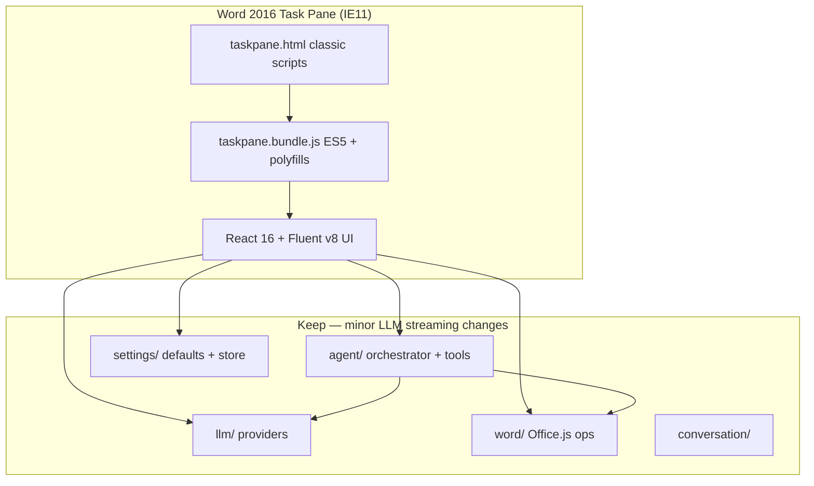

# Word AI Chat — IE11 / Office 2016 Rewrite Plan

> **Tracking doc.** Grand plan to support Word 2016 desktop on Windows (IE11 task-pane WebView).  
> **Last updated:** 2026-06-19  
> **Status:** IE-3 implemented on branch `ie11-rewrite` — agent + edit preview ready for Word 2016 sign-off

---

## 1. Why we are rewriting

### What we assumed (wrong)

- Word **2016** on Windows would use a **modern Edge WebView** for task panes.

### What is actually true

| Host | Task-pane engine | Runs current app? |
|------|------------------|-------------------|
| Word 2016 Windows | **IE11 (Trident)** | **No** — blank pane |
| Word 2019+ / M365 Windows | WebView2 (Chromium) | Yes |
| Word on the web | Browser | Yes |
| Word Mac | WebKit | Yes (separate QA) |
| Browser dev test | Chrome/Edge | Yes (misleading for 2016) |

Office 2016 **never** switched task panes to Edge. Microsoft added WebView2 starting with Microsoft 365 / Office 2021 channels. Upgrading 2013 → 2016 does **not** fix the WebView.

### What breaks in the current stack

| Layer | Current | IE11 |
|-------|---------|------|
| Dev server | Vite ESM (`type="module"`) | No module scripts |
| Production bundles | ES2022 + dynamic `import()` chunks | No |
| React | 19 | Unsupported |
| Fluent UI | v9 (`@fluentui/react-components`) | Unsupported |
| Language features | Optional chaining, async iterators, `ReadableStream` | No / polyfill-only |
| Chat streaming | `fetch` + `body.getReader()` | No native streams |
| Agent `complete()` | `fetch` + JSON | OK with `fetch` polyfill |

**Conclusion:** Patching Vite with `@vitejs/plugin-legacy` is **not enough**. React 19 and Fluent v9 cannot target IE11. This is a **frontend platform rewrite**, not a small fix.

---

## 2. Rewrite goal

Deliver the **same product capabilities** on **Word 2016 Windows (IE11)** without requiring Office upgrade:

- Onboarding, settings, chat, agent, 10 document tools, edit preview, undo, slash commands, persistence, etc.
- Keep all **domain logic** (agent, LLM adapters, Word operations) and replace **presentation + build**.

### Non-goals

- Supporting Office **2013** (no task-pane parity; manifest/API gaps — stay 2016+)
- Pixel-perfect Fluent v9 visual parity (v8 will look slightly different)
- Modern-only niceties: code-splitting, lazy routes, React 19 concurrent features

---

## 3. Target platform (locked)

| Platform | Engine | Priority |
|----------|--------|----------|
| **Word 2016 Windows** | IE11 | **P0 — must pass** |
| Word 2019+ / M365 Windows | WebView2 | Should still work (regression test) |
| Word on the web | Chromium/Safari | Regression test |
| Word Mac | WebKit | Best-effort |

**IE11 baseline:** Document mode 11, ES5 execution, no native `Promise`/`fetch`/streams (polyfilled).

---

## 4. Recommended target stack

### Chosen direction: **React 16 + Fluent UI v8 + Webpack 5**

| Layer | Current | Target | Rationale |
|-------|---------|--------|-----------|
| UI library | React 19 | **React 16.14.2** | Last React line used in Microsoft Office add-in samples with IE11 |
| Components | Fluent v9 | **@fluentui/react 8.x** | Explicit IE11 support era; Office-native look |
| Icons | `@fluentui/react-icons` v2 | **@fluentui/react-icons-mdl2** or v8 icon set | v9 icons not for IE |
| Build | Vite 7 ESM | **Webpack 5** | Mature `babel-loader` + `core-js` IE11 pipeline |
| Transpile | ES2022 | **ES5** via `@babel/preset-env` (`targets: { ie: 11 }`) |
| Polyfills | None | **core-js 3**, `regenerator-runtime`, `whatwg-fetch` | Promise, Symbol, fetch |
| State | Zustand 5 | **Lightweight store module** (pub/sub) or **Redux 4** | Avoid modern Zustand internals on IE |
| CSS | v9 `makeStyles` + plain CSS | **Fluent v8 `mergeStyles` / `getTheme`** + `index.css` | No CSS-in-JS v9 |
| Bundling | Code-split chunks | **Single taskpane bundle** (+ optional vendor chunk) | IE weak dynamic import |
| Dev HTTPS | office-addin-dev-certs | **Keep** | Already working on Windows |
| TypeScript | 5.x strict | **Keep strict**, emit via Babel only | `tsc --noEmit` for types |

### Alternatives considered (rejected)

| Option | Verdict |
|--------|---------|
| Preact + compat | Smaller, but Fluent v8 integration less documented |
| Vue 2 | IE OK, but full UI rewrite off React patterns |
| Vanilla TS + Fabric Core CSS | Lowest risk, highest UI labor |
| `@vitejs/plugin-legacy` + keep React 19 | **Rejected** — React 19 does not support IE11 |
| `@vitejs/plugin-legacy` + React 17 | Still risky; Fluent v9 still blocked |

---

## 5. Architecture after rewrite



### Keep (refactor-only if needed)

```
src/agent/          orchestrator, tools, system-prompt, slash-commands
src/word/           context, operations, ranges, undo, document-key
src/conversation/   per-document persistence
src/types/          shared types
src/settings/       defaults.ts (+ IE-safe store)
src/telemetry/
proxy/, scripts/package-addin.mjs, manifest*.xml
```

### Replace / rewrite

```
vite.config.ts           → webpack.config.js
src/taskpane/**          → all components (Fluent v8)
src/hooks/useChat.ts     → IE-safe hooks + streaming fallback
src/hooks/useDocument*.ts
src/settings/store.ts    → IE-safe state
src/llm/*-compatible.ts  → add XHR SSE reader for IE (chat stream)
taskpane.html            → no type="module"; load bundle.js
```

---

## 6. Critical technical work: streaming on IE11

Chat mode uses SSE over `fetch` + `ReadableStream`. IE11 has **no** `ReadableStream`.

### Plan

1. Add `src/llm/sse-reader.ts` with two implementations:
   - **Modern:** current `getReader()` loop
   - **IE:** `XMLHttpRequest` + `onprogress`, parse `data:` lines incrementally
2. `openai-compatible.ts` and `anthropic-compatible.ts` call shared `readSseStream(responseOrXhr)`.
3. Feature-detect at runtime: `typeof ReadableStream !== 'undefined' && body.getReader`.
4. Agent `complete()` stays JSON `fetch` — polyfilled fetch is enough.

### Fallback (if XHR SSE is blocked by CORS)

- Settings flag: **“IE compatibility: disable chat streaming”** → chat uses non-streaming `stream: false` and shows full reply at once.

---

## 7. Phase plan

| Phase | Name | Scope | Exit criteria |
|-------|------|-------|---------------|
| **IE-0** | Proof of life | Webpack + Babel IE11 + polyfills + “Hello Word 2016” | Text renders in Word 2016 pane |
| **IE-1** | Shell + settings | React 16, Fluent v8 theme, Header, Settings, store, certs | Save/load settings in Word 2016 |
| **IE-2** | Chat MVP | Message list/input, context bar, XHR SSE, connection test | Chat streams (or pseudo-streams) in Word 2016 |
| **IE-3** | Agent + edits | Mode bar, agent trace, edit preview, apply/reject/undo | Agent tool loop + preview works in Word 2016 |
| **IE-4** | Feature parity | Slash hints, docs — **no onboarding, no telemetry** | Checklist matches current feature set |
| **IE-5** | Ship | Remove Vite path, update docs, 2016 QA matrix, package | `npm run smoke` + manual 2016 sign-off |

### IE-0 detail

- [x] Add `webpack.config.cjs` (dev + prod)
- [x] Entry: `src/taskpane/main.legacy.tsx` + `src/polyfills.ts`
- [x] `babel.config.cjs`: preset-env `ie: 11`, preset-react (classic runtime)
- [x] `core-js` entry import first
- [x] `taskpane.template.html` — webpack injects ES5 bundle (no `type="module"`)
- [x] `npm run dev` → webpack-dev-server HTTPS port 3000 + office-addin-dev-certs
- [x] Verify in Word 2016: shows "IE11 host OK" message (user sign-off)

### IE-1 detail

- [x] `@fluentui/react@8`, `initializeIcons` + Fluent v8 controls
- [x] Port: `App.legacy`, `Header`, `SettingsPanel`, `ChatPlaceholder` (v8 `Dropdown`, `TextField`, etc.)
- [x] Replace Zustand with `settingsStore` pub/sub module (`store.legacy.ts`)
- [x] Disable webpack HMR + error overlay (fixes red `InvalidArgument` dev overlay noise)
- [ ] Verify in Word 2016: save/load settings, test connection, fetch models
- [x] No onboarding — direct Settings / Chat tabs (user preference; skip wizard)

### IE-2 detail

- [x] Port `ChatPanel`, `MessageList`, `MessageInput`, `ContextBar`, `QuickActions`, `ModeBar`, `ErrorActions`
- [x] Implement `useChat.legacy` without React 19-only APIs (chat mode; agent deferred to IE-3)
- [x] XHR SSE in `src/llm/sse-reader.ts` — used by OpenAI + Anthropic adapters
- [x] `useDocumentContext.legacy` + IE-safe `document-key.legacy` (no `crypto.subtle`)
- [x] Per-document conversation persistence via `store.legacy.ts`
- [ ] Verify in Word 2016: chat streams, context bar, quick actions, retry on error

### IE-3 detail

- [x] Port `ModeBar`, `AgentTrace`, `EditPreview`, `ErrorActions` (Fluent v8 / IE-safe)
- [x] Wire `runAgent` in `useChat.legacy` with apply/reject/undo
- [x] Slash command expansion in agent + chat send path
- [ ] Verify in Word 2016: agent tool loop, edit preview Apply/Reject/Undo

### IE-4 detail

- [x] **Onboarding — skipped** (legacy opens Settings when unconfigured; Chat/Settings header only)
- [x] Conversation persistence (IE-2)
- [x] Model list fetch + Test connection (IE-1)
- [x] **Telemetry — skipped** (no settings UI, no `trackEvent` in legacy bundle)
- [ ] Slash command hints in `MessageInput` (`/fix`, `/table`, … autocomplete list)
- [ ] README: Word 2016 supported, CORS/proxy notes for local routers

### IE-5 detail

- [ ] Delete Vite, React 19, Fluent v9 deps
- [ ] Update `smoke-test.mjs` for webpack output
- [ ] README: Word 2016 Windows = supported host
- [ ] Manual QA matrix (below)

---

## 8. UI porting map (Fluent v9 → v8)

| v9 component | v8 replacement |
|--------------|----------------|
| `FluentProvider` | `ThemeProvider` / `Customizer` |
| `Toolbar`, `ToolbarButton` | `CommandBar` or `Stack` + `IconButton` |
| `Button` | `PrimaryButton`, `DefaultButton` |
| `Input`, `Textarea` | `TextField` multiline |
| `Dropdown`, `Option` | `Dropdown` |
| `Checkbox` | `Checkbox` |
| `Slider` | `Slider` |
| `Spinner` | `Spinner` |
| `MessageBar` | `MessageBar` |
| `makeStyles` | `mergeStyles`, `getTheme` |

**Icons:** Map `@fluentui/react-icons` → MDL2 equivalents (Chat, Settings, Send, etc.).

---

## 9. Build & dev workflow (target)

```bash
npm install
npm run certs          # once, elevated — already done
npm run dev            # webpack-dev-server https://localhost:3000
npm start              # sideload Word 2016
npm run build          # single ES5 bundle → dist/
npm run package        # unchanged packaging flow
npm run smoke          # update for webpack artifacts
```

### Bundle budget (IE11 performance)

| Metric | Target |
|--------|--------|
| taskpane.js (minified) | < 1.5 MB |
| vendor.js (react+fluent) | < 1.5 MB |
| Total transfer | < 3 MB gzipped ~ 800 KB |

Webpack `performance` hints enabled. Avoid duplicating large deps.

---

## 10. Verification matrix (Word 2016 Windows — P0)

| # | Test | Pass |
|---|------|------|
| 1 | Task pane loads UI (not blank) | |
| 2 | Onboarding / settings save | |
| 3 | Test connection | |
| 4 | Chat stream (or non-stream fallback) | |
| 5 | Selection context + refresh | |
| 6 | Agent `get_selection` | |
| 7 | `replace_text` preview → Apply → Undo | |
| 8 | `insert_comment` | |
| 9 | `insert_table` | |
| 10 | Slash `/fix` | |
| 11 | Conversation persists per document | |
| 12 | Retry / copy on error | |

---

## 11. Risks & mitigations

| Risk | Impact | Mitigation |
|------|--------|------------|
| XHR SSE fragile on IE | Chat broken | Non-streaming fallback setting |
| Bundle too large | Slow pane | Single vendor chunk; tree-shake Fluent imports |
| Fluent v8 EOL | No new components | Stable; sufficient for task pane |
| Dual build during migration | Confusion | Feature branch; delete Vite at IE-5 |
| Mac/Web regression | Break modern hosts | Keep same HTML; ES5 runs on WebView2 too |
| `localStorage` limits | Long chats fail | Already capped at 80 messages |
| Office.js API on 2016 | Tool gaps | Already target 2016 API set; test each tool |

---

## 12. Decisions log

| Decision | Choice | Date |
|----------|--------|------|
| Primary host for rewrite | Word 2016 Windows IE11 | 2026-06-19 |
| UI framework | React 16.14 + Fluent UI v8 | 2026-06-19 |
| Build tool | Webpack 5 (replace Vite) | 2026-06-19 |
| Transpile target | ES5 + core-js IE11 | 2026-06-19 |
| Streaming on IE | XHR SSE + non-stream fallback | 2026-06-19 |
| State management | Custom store or Redux 4 (drop Zustand) | 2026-06-19 |
| Code splitting | Off for taskpane | 2026-06-19 |
| Keep agent/llm/word core | Yes | 2026-06-19 |

---

## 13. Migration strategy

### Branch approach

```
main          → current modern stack (frozen at IE-5 tag before merge)
ie11-rewrite  → IE phases IE-0 … IE-5
```

Merge `ie11-rewrite` → `main` when Word 2016 matrix passes. Tag `v1.0.0-ie` optional.

### Incremental vs big-bang

**Recommended: incremental on `ie11-rewrite`**

1. IE-0: Webpack serves alongside Vite (different port 3001) — validate 2016 first
2. IE-1–3: Port screens until agent works
3. IE-5: Switch port 3000 to Webpack; remove Vite

Avoid maintaining two UIs permanently.

---

## 14. Effort estimate

| Phase | Relative effort |
|-------|-----------------|
| IE-0 | 1–2 days |
| IE-1 | 2–3 days |
| IE-2 | 3–4 days (SSE hardest) |
| IE-3 | 3–4 days |
| IE-4 | 2–3 days |
| IE-5 | 1–2 days |
| **Total** | **~12–18 dev days** |

---

## 15. Next action

Start **IE-0**: Webpack + Babel + polyfills + Hello World in Word 2016 task pane.

When approved, implementation order:

1. `webpack.config.js` + `babel.config.js`
2. Polyfill entry + minimal React 16 mount
3. Confirm Word 2016 shows UI
4. Proceed to IE-1 settings shell

---

## 16. Changelog

| Date | Event |
|------|-------|
| 2026-06-19 | IE rewrite plan drafted — Word 2016 IE11 confirmed as P0 host |
| 2026-06-19 | IE-1 — Fluent v8 shell, settings panel, legacy store, WDS overlay off |
| 2026-06-19 | IE-2 — Chat UI, XHR SSE streaming, document context, conversation persistence |
| 2026-06-19 | IE-3 — Agent mode, agent trace, edit preview, apply/reject/undo |
| 2026-06-19 | IE-4 plan revised — onboarding removed; direct Settings/Chat shell kept |
| 2026-06-19 | IE-4 plan revised — telemetry removed from legacy build |